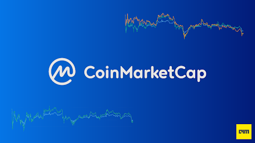

# CoinMarketCap API



Pic source: https://analyticsindiamag.com/guide-to-coinmarketcap-dataset-for-time-series-analysis-historical-prices-of-all-cryptocurrencies/

# Introduction

The Crypto API Project is an automated data collection and analysis tool designed to provide up-to-date information on the top 15 cryptocurrencies by market capitalization. Using the CoinMarketCap API, this project fetches the latest market data at regular intervals and stores it for further analysis.

## Key Features
* **Automated Data Collection:** The project runs continuously, fetching data every four minutes to ensure that the information is always current.

* **Data Storage:** The collected data is stored in a CSV file, enabling easy access and further analysis.

* **Monthly API Call Limit Management:** The project includes logic to manage API call limits, ensuring that it does not exceed the predefined monthly limit of 10,000 calls by CoinMarketCap.


```python
#from API documentation via this link: https://coinmarketcap.com/api/documentation/v1/
#Only want the first 15 cryptocurrencies

from requests import Request, Session
from requests.exceptions import ConnectionError, Timeout, TooManyRedirects
import json

url = 'https://pro-api.coinmarketcap.com/v1/cryptocurrency/listings/latest'
parameters = {
  'start':'1',
  'limit':'15',
  'convert':'USD'
}
headers = {
  'Accepts': 'application/json',
  'X-CMC_PRO_API_KEY': 'YOUR-API',
}

session = Session()
session.headers.update(headers)

try:
  response = session.get(url, params=parameters)
  data = json.loads(response.text)
  print(data)
except (ConnectionError, Timeout, TooManyRedirects) as e:
  print(e)
```

    {'status': {'timestamp': '2024-06-01T15:28:43.658Z', 'error_code': 0, 'error_message': None, 'elapsed': 42, 'credit_count': 1, 'notice': None, 'total_count': 10071}, 'data': [{'id': 1, 'name': 'Bitcoin', 'symbol': 'BTC', 'slug': 'bitcoin', 'num_market_pairs': 11096, 'date_added': '2010-07-13T00:00:00.000Z', 'tags': ['mineable', 'pow', 'sha-256', 'store-of-value', 'state-channel', 'coinbase-ventures-portfolio', 'three-arrows-capital-portfolio', 'polychain-capital-portfolio', 'binance-labs-portfolio', 'blockchain-capital-portfolio', 'boostvc-portfolio', 'cms-holdings-portfolio', 'dcg-portfolio', 'dragonfly-capital-portfolio', 'electric-capital-portfolio', 'fabric-ventures-portfolio', 'framework-ventures-portfolio', 'galaxy-digital-portfolio', 'huobi-capital-portfolio', 'alameda-research-portfolio', 'a16z-portfolio', '1confirmation-portfolio', 'winklevoss-capital-portfolio', 'usv-portfolio', 'placeholder-ventures-portfolio', 'pantera-capital-portfolio', 'multicoin-capital-portfolio', 'paradigm-portfolio', 'bitcoin-ecosystem', 'ftx-bankruptcy-estate'], 'max_supply': 21000000, 'circulating_supply': 19706431, 'total_supply': 19706431, 'infinite_supply': False, 'platform': None, 'cmc_rank': 1, 'self_reported_circulating_supply': None, 'self_reported_market_cap': None, 'tvl_ratio': None, 'last_updated': '2024-06-01T15:26:00.000Z', 'quote': {'USD': {'price': 67711.92323757683, 'volume_24h': 17478298135.435112, 'volume_change_24h': -38.2813, 'percent_change_1h': -0.03089598, 'percent_change_24h': 0.51762976, 'percent_change_7d': -2.08041158, 'percent_change_30d': 14.11703134, 'percent_change_60d': 2.74279713, 'percent_change_90d': 8.80924062, 'market_cap': 1334360343158.6045, 'market_cap_dominance': 52.6547, 'fully_diluted_market_cap': 1421950387989.11, 'tvl': None, 'last_updated': '2024-06-01T15:26:00.000Z'}}}, {'id': 1027, 'name': 'Ethereum', 'symbol': 'ETH', 'slug': 'ethereum', 'num_market_pairs': 9018, 'date_added': '2015-08-07T00:00:00.000Z', 'tags': ['pos', 'smart-contracts', 'ethereum-ecosystem', 'coinbase-ventures-portfolio', 'three-arrows-capital-portfolio', 'polychain-capital-portfolio', 'binance-labs-portfolio', 'blockchain-capital-portfolio', 'boostvc-portfolio', 'cms-holdings-portfolio', 'dcg-portfolio', 'dragonfly-capital-portfolio', 'electric-capital-portfolio', 'fabric-ventures-portfolio', 'framework-ventures-portfolio', 'hashkey-capital-portfolio', 'kenetic-capital-portfolio', 'huobi-capital-portfolio', 'alameda-research-portfolio', 'a16z-portfolio', '1confirmation-portfolio', 'winklevoss-capital-portfolio', 'usv-portfolio', 'placeholder-ventures-portfolio', 'pantera-capital-portfolio', 'multicoin-capital-portfolio', 'paradigm-portfolio', 'injective-ecosystem', 'layer-1', 'ftx-bankruptcy-estate'], 'max_supply': None, 'circulating_supply': 120142090.73330347, 'total_supply': 120142090.73330347, 'infinite_supply': True, 'platform': None, 'cmc_rank': 2, 'self_reported_circulating_supply': None, 'self_reported_market_cap': None, 'tvl_ratio': None, 'last_updated': '2024-06-01T15:25:00.000Z', 'quote': {'USD': {'price': 3806.8527716482645, 'volume_24h': 11152172057.305702, 'volume_change_24h': -25.7736, 'percent_change_1h': 0.11991459, 'percent_change_24h': 1.04909371, 'percent_change_7d': 1.57448267, 'percent_change_30d': 26.90540955, 'percent_change_60d': 15.50672034, 'percent_change_90d': 11.0214761, 'market_cap': 457363251099.6936, 'market_cap_dominance': 18.052, 'fully_diluted_market_cap': 457363251099.69, 'tvl': None, 'last_updated': '2024-06-01T15:25:00.000Z'}}}, {'id': 825, 'name': 'Tether USDt', 'symbol': 'USDT', 'slug': 'tether', 'num_market_pairs': 87491, 'date_added': '2015-02-25T00:00:00.000Z', 'tags': ['stablecoin', 'asset-backed-stablecoin', 'avalanche-ecosystem', 'solana-ecosystem', 'arbitrum-ecosytem', 'moonriver-ecosystem', 'injective-ecosystem', 'bnb-chain', 'usd-stablecoin', 'optimism-ecosystem', 'fiat-stablecoin'], 'max_supply': None, 'circulating_supply': 112141340734.72765, 'total_supply': 115086550406.94923, 'platform': {'id': 1027, 'name': 'Ethereum', 'symbol': 'ETH', 'slug': 'ethereum', 'token_address': '0xdac17f958d2ee523a2206206994597c13d831ec7'}, 'infinite_supply': True, 'cmc_rank': 3, 'self_reported_circulating_supply': None, 'self_reported_market_cap': None, 'tvl_ratio': None, 'last_updated': '2024-06-01T15:25:00.000Z', 'quote': {'USD': {'price': 0.9991426036532164, 'volume_24h': 42823519461.84376, 'volume_change_24h': -28.4862, 'percent_change_1h': 0.01282979, 'percent_change_24h': -0.00277843, 'percent_change_7d': -0.08081934, 'percent_change_30d': -0.09270636, 'percent_change_60d': -0.09574072, 'percent_change_90d': -0.13026313, 'market_cap': 112045191158.85828, 'market_cap_dominance': 4.4224, 'fully_diluted_market_cap': 114987875619.07, 'tvl': None, 'last_updated': '2024-06-01T15:25:00.000Z'}}}, {'id': 1839, 'name': 'BNB', 'symbol': 'BNB', 'slug': 'bnb', 'num_market_pairs': 2173, 'date_added': '2017-07-25T00:00:00.000Z', 'tags': ['marketplace', 'centralized-exchange', 'payments', 'smart-contracts', 'alameda-research-portfolio', 'multicoin-capital-portfolio', 'bnb-chain', 'layer-1', 'sec-security-token', 'alleged-sec-securities', 'celsius-bankruptcy-estate'], 'max_supply': None, 'circulating_supply': 147585277.02826685, 'total_supply': 147585277.02826685, 'infinite_supply': False, 'platform': None, 'cmc_rank': 4, 'self_reported_circulating_supply': None, 'self_reported_market_cap': None, 'tvl_ratio': None, 'last_updated': '2024-06-01T15:25:00.000Z', 'quote': {'USD': {'price': 597.4037085077657, 'volume_24h': 1475701100.3364832, 'volume_change_24h': -7.965, 'percent_change_1h': 0.15146928, 'percent_change_24h': 0.74702357, 'percent_change_7d': -0.88279047, 'percent_change_30d': 5.71059842, 'percent_change_60d': 7.1287001, 'percent_change_90d': 44.2907123, 'market_cap': 88167991817.83258, 'market_cap_dominance': 3.48, 'fully_diluted_market_cap': 88167991817.83, 'tvl': None, 'last_updated': '2024-06-01T15:25:00.000Z'}}}, {'id': 5426, 'name': 'Solana', 'symbol': 'SOL', 'slug': 'solana', 'num_market_pairs': 669, 'date_added': '2020-04-10T00:00:00.000Z', 'tags': ['pos', 'platform', 'solana-ecosystem', 'cms-holdings-portfolio', 'kenetic-capital-portfolio', 'alameda-research-portfolio', 'multicoin-capital-portfolio', 'okx-ventures-portfolio', 'layer-1', 'ftx-bankruptcy-estate', 'sec-security-token', 'alleged-sec-securities', 'cmc-crypto-awards-2024'], 'max_supply': None, 'circulating_supply': 459698026.6221229, 'total_supply': 577256889.5349644, 'infinite_supply': True, 'platform': None, 'cmc_rank': 5, 'self_reported_circulating_supply': None, 'self_reported_market_cap': None, 'tvl_ratio': None, 'last_updated': '2024-06-01T15:25:00.000Z', 'quote': {'USD': {'price': 167.50743893538618, 'volume_24h': 1496946281.9258385, 'volume_change_24h': -43.1035, 'percent_change_1h': 0.13157364, 'percent_change_24h': 1.02443235, 'percent_change_7d': -0.60552244, 'percent_change_30d': 19.87227302, 'percent_change_60d': -7.789358, 'percent_change_90d': 29.6891161, 'market_cap': 77002839123.12277, 'market_cap_dominance': 3.0393, 'fully_diluted_market_cap': 96694823173.81, 'tvl': None, 'last_updated': '2024-06-01T15:25:00.000Z'}}}, {'id': 3408, 'name': 'USDC', 'symbol': 'USDC', 'slug': 'usd-coin', 'num_market_pairs': 19520, 'date_added': '2018-10-08T00:00:00.000Z', 'tags': ['medium-of-exchange', 'stablecoin', 'asset-backed-stablecoin', 'coinbase-ventures-portfolio', 'hedera-hashgraph-ecosystem', 'fantom-ecosystem', 'arbitrum-ecosytem', 'moonriver-ecosystem', 'bnb-chain', 'usd-stablecoin', 'optimism-ecosystem', 'fiat-stablecoin'], 'max_supply': None, 'circulating_supply': 32368833685.309906, 'total_supply': 32368833685.309906, 'platform': {'id': 1027, 'name': 'Ethereum', 'symbol': 'ETH', 'slug': 'ethereum', 'token_address': '0xa0b86991c6218b36c1d19d4a2e9eb0ce3606eb48'}, 'infinite_supply': False, 'cmc_rank': 6, 'self_reported_circulating_supply': None, 'self_reported_market_cap': None, 'tvl_ratio': None, 'last_updated': '2024-06-01T15:25:00.000Z', 'quote': {'USD': {'price': 1.000222946392991, 'volume_24h': 4159817098.207451, 'volume_change_24h': -32.8365, 'percent_change_1h': 0.01312637, 'percent_change_24h': 0.01435991, 'percent_change_7d': 0.01802717, 'percent_change_30d': 0.01437005, 'percent_change_60d': 0.01854437, 'percent_change_90d': 0.03787023, 'market_cap': 32376050200.02537, 'market_cap_dominance': 1.2779, 'fully_diluted_market_cap': 32376050200.03, 'tvl': None, 'last_updated': '2024-06-01T15:25:00.000Z'}}}, {'id': 52, 'name': 'XRP', 'symbol': 'XRP', 'slug': 'xrp', 'num_market_pairs': 1333, 'date_added': '2013-08-04T00:00:00.000Z', 'tags': ['medium-of-exchange', 'enterprise-solutions', 'arrington-xrp-capital-portfolio', 'galaxy-digital-portfolio', 'a16z-portfolio', 'pantera-capital-portfolio', 'ftx-bankruptcy-estate'], 'max_supply': 100000000000, 'circulating_supply': 55450358947, 'total_supply': 99987572899, 'infinite_supply': False, 'platform': None, 'cmc_rank': 7, 'self_reported_circulating_supply': None, 'self_reported_market_cap': None, 'tvl_ratio': None, 'last_updated': '2024-06-01T15:26:00.000Z', 'quote': {'USD': {'price': 0.520815532602451, 'volume_24h': 707848101.0686182, 'volume_change_24h': -42.1003, 'percent_change_1h': -0.05713069, 'percent_change_24h': -0.0338031, 'percent_change_7d': -3.86836214, 'percent_change_30d': -0.11547758, 'percent_change_60d': -11.78707809, 'percent_change_90d': -16.36778732, 'market_cap': 28879408227.978886, 'market_cap_dominance': 1.1399, 'fully_diluted_market_cap': 52081553260.25, 'tvl': None, 'last_updated': '2024-06-01T15:26:00.000Z'}}}, {'id': 74, 'name': 'Dogecoin', 'symbol': 'DOGE', 'slug': 'dogecoin', 'num_market_pairs': 975, 'date_added': '2013-12-15T00:00:00.000Z', 'tags': ['mineable', 'pow', 'scrypt', 'medium-of-exchange', 'memes', 'payments', 'doggone-doggerel', 'bnb-chain', 'ftx-bankruptcy-estate'], 'max_supply': None, 'circulating_supply': 144530506383.7052, 'total_supply': 144530506383.7052, 'infinite_supply': True, 'platform': None, 'cmc_rank': 8, 'self_reported_circulating_supply': None, 'self_reported_market_cap': None, 'tvl_ratio': None, 'last_updated': '2024-06-01T15:26:00.000Z', 'quote': {'USD': {'price': 0.1605148335911048, 'volume_24h': 706069348.5236803, 'volume_change_24h': -34.4427, 'percent_change_1h': -0.2472433, 'percent_change_24h': 0.99010181, 'percent_change_7d': -4.69421144, 'percent_change_30d': 20.10934257, 'percent_change_60d': -14.07694406, 'percent_change_90d': 15.19927133, 'market_cap': 23199290181.01855, 'market_cap_dominance': 0.9157, 'fully_diluted_market_cap': 23199290181.02, 'tvl': None, 'last_updated': '2024-06-01T15:26:00.000Z'}}}, {'id': 2010, 'name': 'Cardano', 'symbol': 'ADA', 'slug': 'cardano', 'num_market_pairs': 1189, 'date_added': '2017-10-01T00:00:00.000Z', 'tags': ['dpos', 'pos', 'platform', 'research', 'smart-contracts', 'staking', 'cardano-ecosystem', 'cardano', 'layer-1', 'sec-security-token', 'alleged-sec-securities'], 'max_supply': 45000000000, 'circulating_supply': 35700460169.947, 'total_supply': 36925434173.444, 'infinite_supply': False, 'platform': None, 'cmc_rank': 9, 'self_reported_circulating_supply': None, 'self_reported_market_cap': None, 'tvl_ratio': None, 'last_updated': '2024-06-01T15:25:00.000Z', 'quote': {'USD': {'price': 0.4495830613296638, 'volume_24h': 207712400.41250786, 'volume_change_24h': -29.3576, 'percent_change_1h': -0.02405294, 'percent_change_24h': -0.23141596, 'percent_change_7d': -2.44811646, 'percent_change_30d': -2.21518146, 'percent_change_60d': -23.65256746, 'percent_change_90d': -38.03709513, 'market_cap': 16050322174.0825, 'market_cap_dominance': 0.6335, 'fully_diluted_market_cap': 20231237759.83, 'tvl': None, 'last_updated': '2024-06-01T15:25:00.000Z'}}}, {'id': 11419, 'name': 'Toncoin', 'symbol': 'TON', 'slug': 'toncoin', 'num_market_pairs': 382, 'date_added': '2021-08-26T13:40:22.000Z', 'tags': ['pos', 'layer-1', 'ftx-bankruptcy-estate', 'dwf-labs-portfolio', 'toncoin-ecosystem'], 'max_supply': None, 'circulating_supply': 2412328696.044575, 'total_supply': 5107159891.962288, 'infinite_supply': True, 'platform': None, 'cmc_rank': 10, 'self_reported_circulating_supply': 3414166606, 'self_reported_market_cap': 21501879738.454178, 'tvl_ratio': None, 'last_updated': '2024-06-01T15:25:00.000Z', 'quote': {'USD': {'price': 6.297841382628232, 'volume_24h': 129753301.91221951, 'volume_change_24h': -9.1796, 'percent_change_1h': -0.11836245, 'percent_change_24h': -1.59719069, 'percent_change_7d': -2.31268899, 'percent_change_30d': 25.92978163, 'percent_change_60d': 25.23962363, 'percent_change_90d': 137.71725519, 'market_cap': 15192463490.451128, 'market_cap_dominance': 0.5996, 'fully_diluted_market_cap': 32164082915.3, 'tvl': None, 'last_updated': '2024-06-01T15:25:00.000Z'}}}, {'id': 5994, 'name': 'Shiba Inu', 'symbol': 'SHIB', 'slug': 'shiba-inu', 'num_market_pairs': 828, 'date_added': '2020-08-01T00:00:00.000Z', 'tags': ['memes', 'ethereum-ecosystem', 'doggone-doggerel'], 'max_supply': None, 'circulating_supply': 589271829576220.8, 'total_supply': 589519966647077.9, 'platform': {'id': 1027, 'name': 'Ethereum', 'symbol': 'ETH', 'slug': 'ethereum', 'token_address': '0x95ad61b0a150d79219dcf64e1e6cc01f0b64c4ce'}, 'infinite_supply': False, 'cmc_rank': 11, 'self_reported_circulating_supply': None, 'self_reported_market_cap': None, 'tvl_ratio': None, 'last_updated': '2024-06-01T15:25:00.000Z', 'quote': {'USD': {'price': 2.5417521204202936e-05, 'volume_24h': 387563651.44852966, 'volume_change_24h': -41.3246, 'percent_change_1h': 0.21736102, 'percent_change_24h': -0.99382844, 'percent_change_7d': 2.20325562, 'percent_change_30d': 9.57716374, 'percent_change_60d': -4.50185937, 'percent_change_90d': 17.85615305, 'market_cap': 14977829223.293049, 'market_cap_dominance': 0.5912, 'fully_diluted_market_cap': 14984136252.55, 'tvl': None, 'last_updated': '2024-06-01T15:25:00.000Z'}}}, {'id': 5805, 'name': 'Avalanche', 'symbol': 'AVAX', 'slug': 'avalanche', 'num_market_pairs': 735, 'date_added': '2020-07-13T00:00:00.000Z', 'tags': ['defi', 'smart-contracts', 'three-arrows-capital-portfolio', 'polychain-capital-portfolio', 'avalanche-ecosystem', 'cms-holdings-portfolio', 'dragonfly-capital-portfolio', 'moonriver-ecosystem', 'injective-ecosystem', 'real-world-assets', 'layer-1'], 'max_supply': 715748719, 'circulating_supply': 393109862.0421839, 'total_supply': 442456232.0421839, 'infinite_supply': False, 'platform': None, 'cmc_rank': 12, 'self_reported_circulating_supply': None, 'self_reported_market_cap': None, 'tvl_ratio': None, 'last_updated': '2024-06-01T15:25:00.000Z', 'quote': {'USD': {'price': 36.06834437287699, 'volume_24h': 202804903.67799652, 'volume_change_24h': -35.1733, 'percent_change_1h': -0.15759854, 'percent_change_24h': 0.55621077, 'percent_change_7d': -5.62729584, 'percent_change_30d': 6.00560191, 'percent_change_60d': -24.48684583, 'percent_change_90d': -15.66983255, 'market_cap': 14178821880.511654, 'market_cap_dominance': 0.5596, 'fully_diluted_market_cap': 25815871281.34, 'tvl': None, 'last_updated': '2024-06-01T15:25:00.000Z'}}}, {'id': 1975, 'name': 'Chainlink', 'symbol': 'LINK', 'slug': 'chainlink', 'num_market_pairs': 1787, 'date_added': '2017-09-20T00:00:00.000Z', 'tags': ['platform', 'defi', 'oracles', 'smart-contracts', 'substrate', 'polkadot', 'polkadot-ecosystem', 'avalanche-ecosystem', 'solana-ecosystem', 'framework-ventures-portfolio', 'polygon-ecosystem', 'fantom-ecosystem', 'cardano-ecosystem', 'web3', 'near-protocol-ecosystem', 'arbitrum-ecosytem', 'cardano', 'injective-ecosystem', 'optimism-ecosystem', 'real-world-assets', 'celsius-bankruptcy-estate'], 'max_supply': 1000000000, 'circulating_supply': 587099970.4527867, 'total_supply': 1000000000, 'platform': {'id': 1027, 'name': 'Ethereum', 'symbol': 'ETH', 'slug': 'ethereum', 'token_address': '0x514910771af9ca656af840dff83e8264ecf986ca'}, 'infinite_supply': False, 'cmc_rank': 13, 'self_reported_circulating_supply': None, 'self_reported_market_cap': None, 'tvl_ratio': None, 'last_updated': '2024-06-01T15:25:00.000Z', 'quote': {'USD': {'price': 18.608232610892664, 'volume_24h': 386488486.77302194, 'volume_change_24h': -2.8269, 'percent_change_1h': 0.30017191, 'percent_change_24h': 4.95020873, 'percent_change_7d': 8.47663287, 'percent_change_30d': 36.54258179, 'percent_change_60d': 3.83520218, 'percent_change_90d': -9.24408053, 'market_cap': 10924892816.033665, 'market_cap_dominance': 0.4312, 'fully_diluted_market_cap': 18608232610.89, 'tvl': None, 'last_updated': '2024-06-01T15:25:00.000Z'}}}, {'id': 6636, 'name': 'Polkadot', 'symbol': 'DOT', 'slug': 'polkadot-new', 'num_market_pairs': 774, 'date_added': '2020-08-19T00:00:00.000Z', 'tags': ['substrate', 'polkadot', 'binance-chain', 'polkadot-ecosystem', 'three-arrows-capital-portfolio', 'polychain-capital-portfolio', 'arrington-xrp-capital-portfolio', 'blockchain-capital-portfolio', 'boostvc-portfolio', 'cms-holdings-portfolio', 'coinfund-portfolio', 'fabric-ventures-portfolio', 'fenbushi-capital-portfolio', 'hashkey-capital-portfolio', 'kenetic-capital-portfolio', '1confirmation-portfolio', 'placeholder-ventures-portfolio', 'pantera-capital-portfolio', 'exnetwork-capital-portfolio', 'web3', 'spartan-group', 'injective-ecosystem', 'bnb-chain', 'layer-1'], 'max_supply': None, 'circulating_supply': 1437953431.368154, 'total_supply': 1437953431.368154, 'infinite_supply': True, 'platform': None, 'cmc_rank': 14, 'self_reported_circulating_supply': 1451892807.902116, 'self_reported_market_cap': 10324245443.935543, 'tvl_ratio': None, 'last_updated': '2024-06-01T15:26:00.000Z', 'quote': {'USD': {'price': 7.11088682838326, 'volume_24h': 145208886.6310823, 'volume_change_24h': -20.6544, 'percent_change_1h': -0.12722433, 'percent_change_24h': 2.50331212, 'percent_change_7d': -3.02092075, 'percent_change_30d': 0.91402363, 'percent_change_60d': -17.10919786, 'percent_change_90d': -23.54201292, 'market_cap': 10225124114.944319, 'market_cap_dominance': 0.4036, 'fully_diluted_market_cap': 10225124114.94, 'tvl': None, 'last_updated': '2024-06-01T15:26:00.000Z'}}}, {'id': 1958, 'name': 'TRON', 'symbol': 'TRX', 'slug': 'tron', 'num_market_pairs': 985, 'date_added': '2017-09-13T00:00:00.000Z', 'tags': ['media', 'payments', 'tron-ecosystem', 'layer-1', 'dwf-labs-portfolio', 'sec-security-token', 'alleged-sec-securities'], 'max_supply': None, 'circulating_supply': 87371139931.27109, 'total_supply': 87371213858.83676, 'infinite_supply': True, 'platform': None, 'cmc_rank': 15, 'self_reported_circulating_supply': 71659659264, 'self_reported_market_cap': 8031750864.145509, 'tvl_ratio': None, 'last_updated': '2024-06-01T15:25:00.000Z', 'quote': {'USD': {'price': 0.11208190140223646, 'volume_24h': 203331542.773364, 'volume_change_24h': -25.7233, 'percent_change_1h': 0.14881163, 'percent_change_24h': 0.19124614, 'percent_change_7d': -1.25053266, 'percent_change_30d': -9.02027546, 'percent_change_60d': -3.85331919, 'percent_change_90d': -20.0525728, 'market_cap': 9792723491.17773, 'market_cap_dominance': 0.3865, 'fully_diluted_market_cap': 9792731777.12, 'tvl': None, 'last_updated': '2024-06-01T15:25:00.000Z'}}}]}
    


```python
type(data)
```


    dict


```python
import pandas as pd

pd.set_option('display.max_columns', None)
```


```python
df = pd.json_normalize(data['data'])
df['timestamp'] = pd.to_datetime('now')
df
```


# Data Fetching Process
The data is retrieved from the CoinMarketCap API, which provides detailed and current information on various cryptocurrencies. The project uses the `requests` library in Python to send API requests and handle responses. Here's a brief overview of the data fetching and storage process:

1. **API Endpoint:** The project accesses the CoinMarketCap API endpoint for the latest cryptocurrency listings.

2. **Parameters:** The API request is configured to fetch data for the top 15 cryptocurrencies, with prices converted to USD.

3. **Headers:** The request includes the necessary API key for authentication.

4. **Session Management:** A session is created to manage and streamline the API requests.

5. **Error Handling:** The project includes error handling for potential issues such as connection errors, timeouts, and too many redirects.

The fetched data includes various attributes of each cryptocurrency, such as current price, market capitalization, 24-hour trading volume, and more. This data is then can be processed and visualized to provide meaningful insights.


```python
import os
from time import sleep
import datetime
from requests import Session, ConnectionError, Timeout, TooManyRedirects

# Define the monthly limit and initialize the call counter
MONTHLY_LIMIT = 10000
calls_made = 0

def api_runner():
    url = 'https://pro-api.coinmarketcap.com/v1/cryptocurrency/listings/latest'
    parameters = {
        'start': '1',
        'limit': '15',
        'convert': 'USD'
    }
    headers = {
        'Accepts': 'application/json',
        'X-CMC_PRO_API_KEY': 'YOUR-API',
    }
    
    session = Session()
    session.headers.update(headers)
    
    try:
        response = session.get(url, params=parameters)
        data = json.loads(response.text)
        print(data)  # Print the data if needed for debugging
    except (ConnectionError, Timeout, TooManyRedirects) as e:
        print(e)
        return

    # Convert JSON data to DataFrame
    df = pd.json_normalize(data['data'])
    # Add a timestamp
    df['timestamp'] = pd.to_datetime('now')
    
    # Append the DataFrame to a CSV file
    if not os.path.isfile('crypto_data.csv'):
        df.to_csv('crypto_data.csv', index=False)
    else:
        df.to_csv('crypto_data.csv', mode='a', header=False, index=False)

def reset_monthly_counter():
    global calls_made
    calls_made = 0

# Infinite loop to keep the script running
while True:
    current_time = datetime.datetime.now()

    # Reset the counter at the beginning of a new month
    if current_time.day == 1 and current_time.hour == 0 and current_time.minute == 0:
        reset_monthly_counter()

    # Check if we have reached the monthly limit
    if calls_made < MONTHLY_LIMIT:
        api_runner()
        print('API Runner completed')
        calls_made += 1
        sleep(240)  # Sleep for 240 seconds (4 minutes)
    else:
        # Calculate seconds until the start of the next month to sleep
        next_month = (current_time.replace(day=28) + datetime.timedelta(days=4)).replace(day=1, hour=0, minute=0, second=0, microsecond=0)
        seconds_until_next_month = (next_month - current_time).total_seconds()
        print(f'Monthly limit reached. Sleeping for {seconds_until_next_month} seconds.')
        sleep(seconds_until_next_month + 1)  # Sleep until the start of the next month
```
